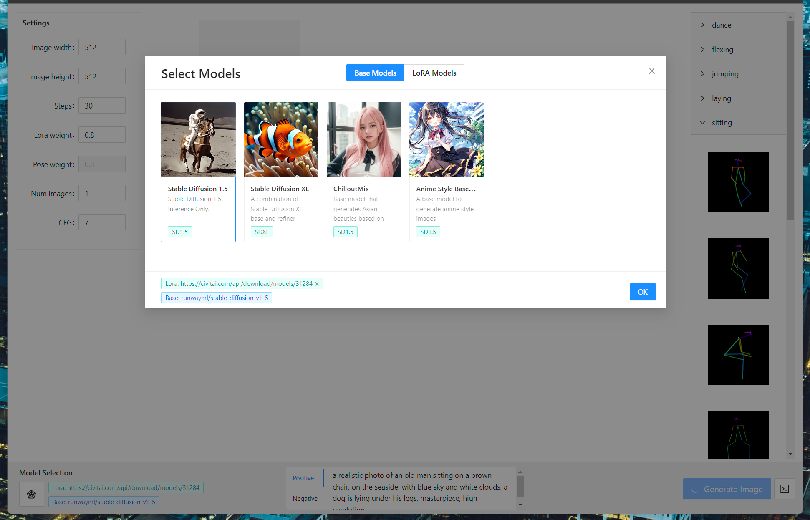
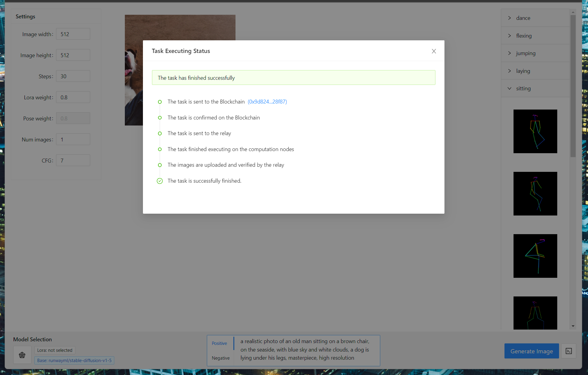
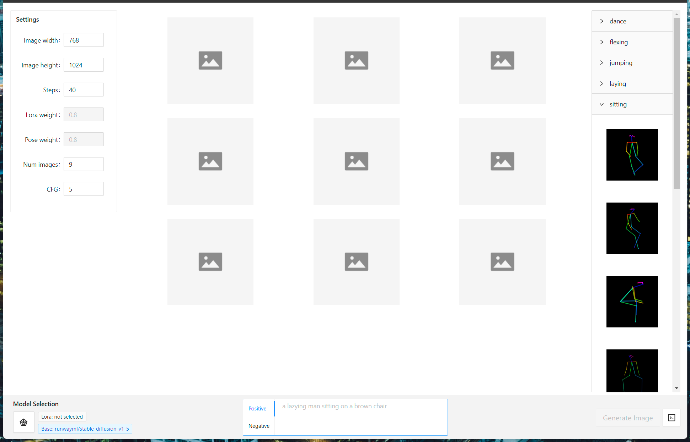

# Stable Diffusion Image Generator

A showcase application that provides a web interface for users to generate images in the browser using Stable Diffusion.
The application connects to the Crynux Network to utilize the remote GPUs so that the users could use the application on any devices without GPUs.

The Blockchain and token stuff are handled at the backend. To the end users, this is just a traditional easy-to-use web application, nothing special. 

Try the application at: [https://ig.crynux.ai](https://ig.crynux.ai)

## Screenshots

### Model selection
The popular models are listed as options. The suers may also provide links to models on Huggingface, Civitai, and other model hosting websites.



### Task running status
The only place where we can find something different about the architecture.


### Text-to-Image generation
Generation images using text prompt. Supports LoRA and Controlnet.



## Development

### Configuration

The config file is located at:

```
./src/config.json
```

Where you could change the backend server address, and tweak other options.

### Install the dependencies

```shell
$ yarn install
```

### Start dev server

The project could be built using yarn:

```shell
$ yarn dev
```

### Build release package

```shell
$ yarn build
```
